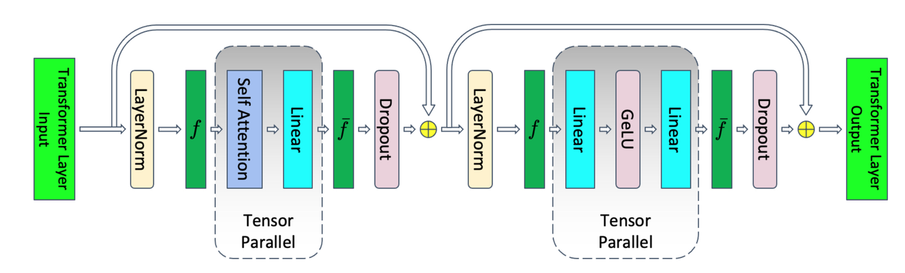
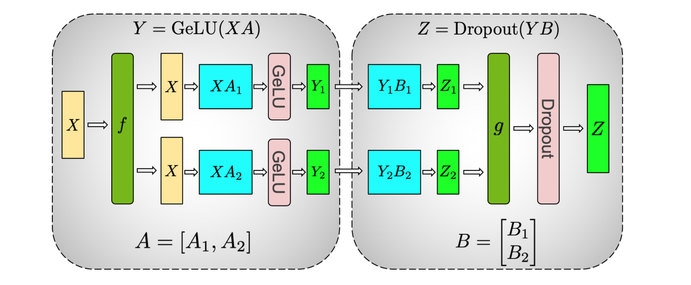
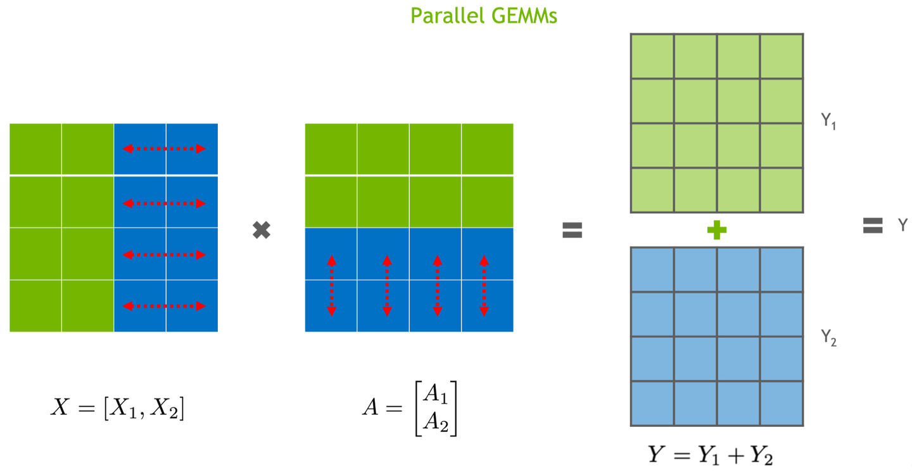
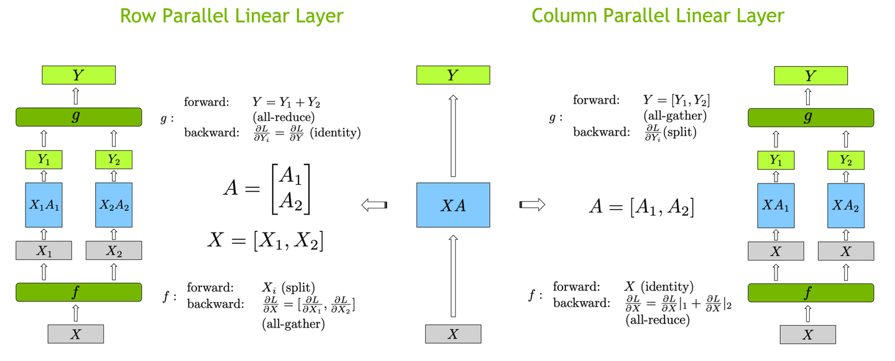
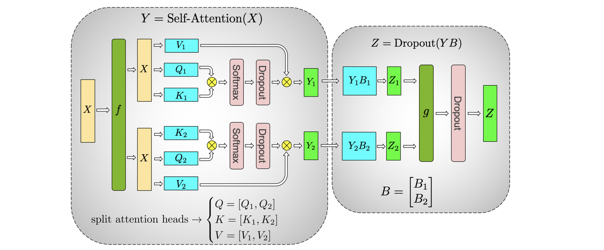
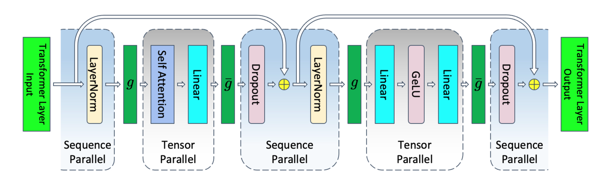

==补充一下代码实现==
megatron tp就是对连续的两个矩阵乘，第一个列切  第二个行切， 只需要进行一次all reduce的通信
tp只对attention内和mlp内的权重有效，
#### Megatron-LM tp （矩阵乘切分 降低权重占用）
对attention和mlp两个模块的权重进行切分，这两个模块都是有矩阵乘的部分，tp的前提的矩阵乘运算的可切分性；

以MLP为例，计算过程如下
$$Z=Dropout(GeLU(XA)B)$$
MLP的tp过程如下，权重矩阵A列切，权重矩阵B行切，最终得到的结果需要进行reduce(求和)

矩阵乘可切分性如下所示：
+ 只有一个矩阵乘 **权重列切 输入不需要切** 需要all-gather（图2右）
+ 只有一个矩阵乘 **权重行切 输入需要行切** 需要all-reduce（下图1和图2左）
+ 有两个矩阵乘 **第一个列切，第二个行切， 不切输入**，最后需要一个all-reduce（上图）


行切和列切对比如下：

attention的tp类似：attention中一般有个qkv_proj和o_proj，对这两个过程的权重进行切分， 输入不动，以qwen2为例，Qwen2Attention代码如下：
```python
class Qwen2Attention(nn.Module):
    def __init__():
        self.qkv_proj = QKVParallelLinear(xxx)
        self.o_proj = RowParallelLinear(xxx)
        self.attn = Attention(xxx)
        self.rotray_embed = RotaryEmbedding(xxx)
    def forward(self, positions: torch.Tensor, hidden_states: torch.Tensor)
        qkv, _ = self.qkv_proj(hidden_states)  # 列切
        q, k, v = qkv.split([self.q_size, self.kv_size, self.kv_size], dim=-1)
        q, k = self.rotary_emb(positions, q, k)
        attn_output = self.attn(q, k, v)
        output, _ = self.o_proj(attn_output)   # 行切
        return output
```

attention计算公式如下，一起写一下，不过与tp无关
$$
\text{Attention}(Q, K, V) = \text{softmax}\left( \frac{QK^\top}{\sqrt{d_k}} \right) V
$$

Attention模块的tp方案如下所示，最后只需要一个all_reduce


#### Megatron-LM sp （序列切分 降低激活值占用）

回头看上述的tp方案，只是对attention和mlp模块的linear权重进行了切分，attention和MLP模块的输入输出都是完整的，去做layernorm dropout等操作，输入长度特别长的情况下，这部分的激活值现存占比巨大，具体的激活值占用情况可参考[猛猿-图解大模型训练系列：序列并行1，Megatron SP - 知乎](https://zhuanlan.zhihu.com/p/4083427292)和原论文[Reducing Activation Recomputation in Large Transformer Models](https://arxiv.org/pdf/2205.05198)

sp与tp搭配使用，整体如下

Q: 为什么说megatron的sp必须与tp搭配使用，不能单独使用sp吗？
A: sp将输入切分为在多个gpu上去做layernorm，已经有多个gpu了难道还把linear的权重都复制一份到每个gpu上吗？太挫了，所以对linear的权重也会切分，即sp tp一起使用，至于Ulysses的sp不和tp搭配使用 到时候具体看下他的方案

该方案下的通信情况：
