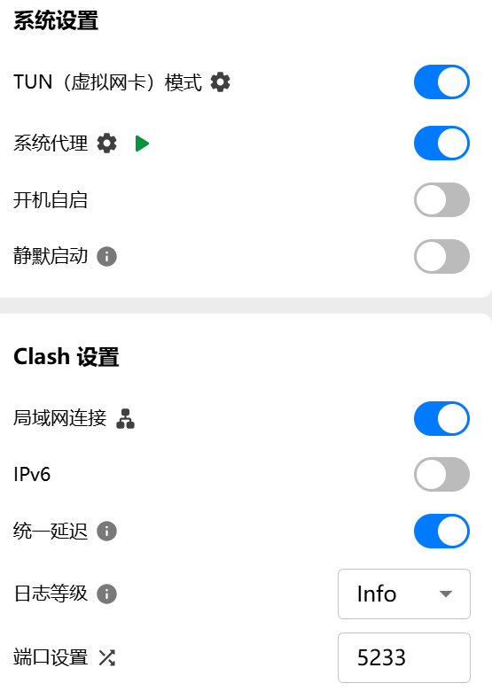
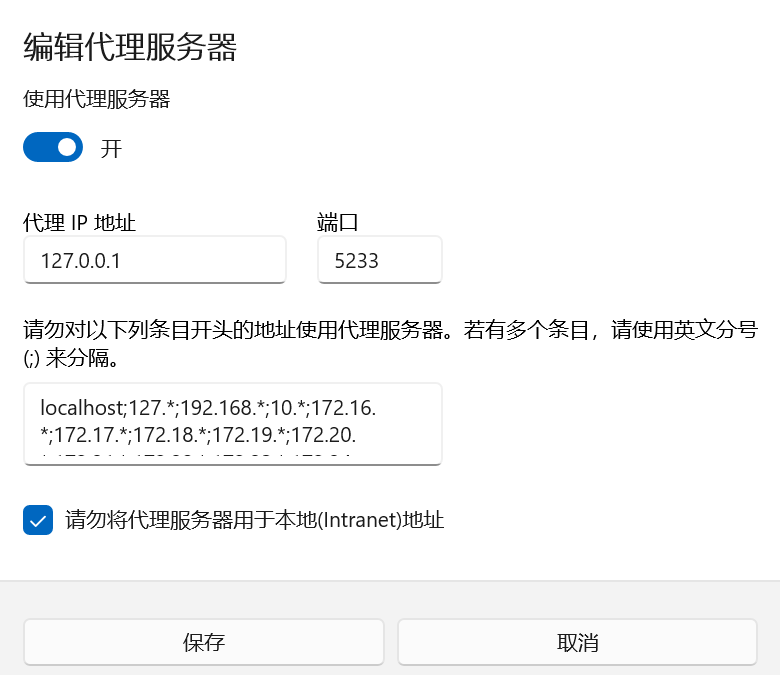
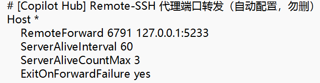
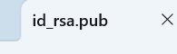
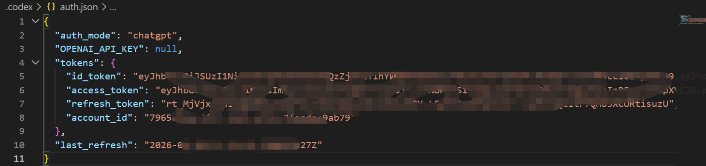
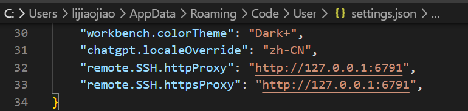
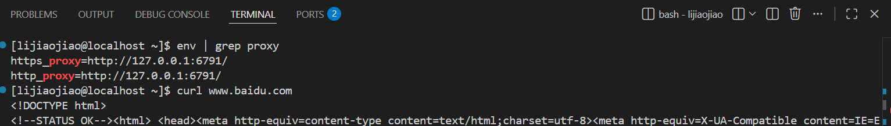
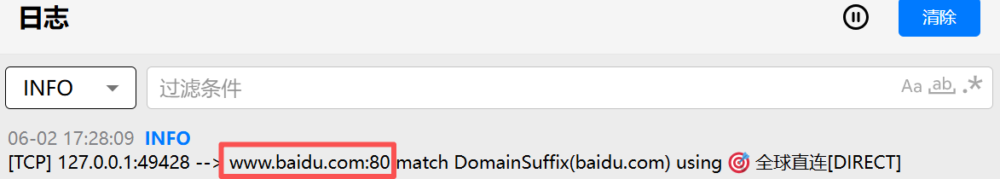
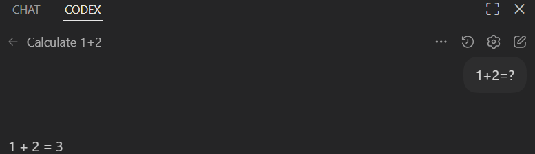

### 命令行相关
modelslim提PR：
在本地改动好后，wsl中cherry-pick过去 跑commit 执行per_commit 或者直接在wsl上新建个分支，最后再提交

### 环境配置相关
vscode登录codex插件： [Codex 登录报错 token exchange failed - Kerry的学习笔记](https://kerrynotes.com/codex-error-token-exchange-failed/)
vscode远程连接docker  登录codex
1 端口映射
clash配置端口5233

本地网络代理（无关）

本地`C:\Users\lijiaojiao\.ssh`中的config配置代理转发，服务器的6791端口走本地的5233

2 配置免密

先用wsl登录，然后登录服务器，安装codex插件，安装codex插件之后根路径下就会有.codex路径，复制wsl的auth.json到服务器codex配置里；到这一步已经可以远程链接服务器并且登录上codex了，还需要配置服务器代理来拿到codex请求返回内容

3 配置proxy

4 验证
在vscode的远端terminal里执行

clash中会收到日志

codex执行成功

使用约束：只能同时开一个vscode连接，不然会端口冲突