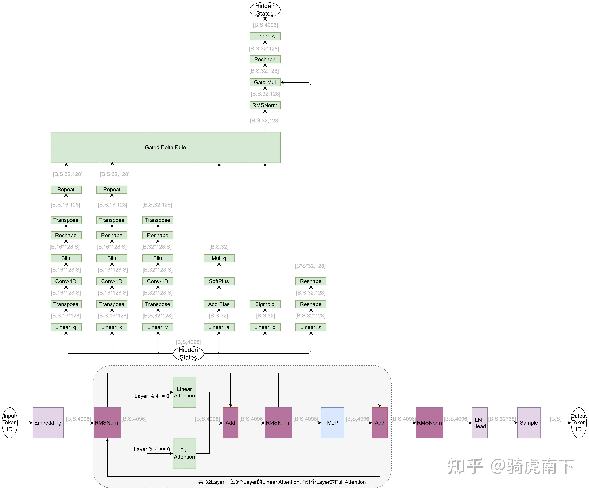

### qwen3next的forward与_forward_core隔离:

1 what？
它们是调用者-被调用者的关系，中间通过一个 vLLM custom op 间接连接
direct_register_custom_op 是 vLLM 对 PyTorch torch.library 的一个轻量封装，用于将普通 Python 函数注册为 torch.ops.vllm.* 命名空间下的自定义算子。相比 torch.library.custom_op 装饰器，它绕过了复杂的 dispatch 逻辑，开销更低。
三步走：define（声明签名）→ impl（注册真实实现）→ register_fake（注册编译用的假实现）

```
def gdn_attention_core(
    mixed_qkv: torch.Tensor,  # 输入
    b: torch.Tensor,           # 输入
    a: torch.Tensor,           # 输入
    core_attn_out: torch.Tensor,  # 输出（原地修改）
    layer_name: str,           # 用于查找 self 的 key
) -> None:
    forward_context = get_forward_context()
    self = forward_context.no_compile_layers[layer_name]
    self._forward_core(mixed_qkv=mixed_qkv, b=b, a=a, core_attn_out=core_attn_out)
```

```
def gdn_attention_core_fake(
    mixed_qkv: torch.Tensor,
    b: torch.Tensor,
    a: torch.Tensor,
    core_attn_out: torch.Tensor,
    layer_name: str,
) -> None:
    return   # 什么都不做，只需要签名匹配
```

```
direct_register_custom_op(
    op_name="gdn_attention_core",          # 算子名
    op_func=gdn_attention_core,            # 真实实现
    mutates_args=["core_attn_out"],        # 声明哪些参数会被原地修改
    fake_impl=gdn_attention_core_fake,     # torch.compile 的假实现
)
```

  
2 why?
核心原因是 torch.compile 兼容性。
_forward_core 内部包含大量动态控制流（if num_prefills > 0、if spec_sequence_masks is not None 等）和有状态的缓存操作（读写 conv_state、ssm_state），这些是 torch.compile 无法有效 trace 的。

编译期（trace）：调用 fake_impl，不执行实际计算，但 torch.compile 知道输出 shape（在这里是 None，因为通过 mutates_args 原地修改）  
运行时：调用 op_func，执行真正的 conv1d + recurrent attention 逻辑

### qwen3 next、qwen3.5的模型结果和vllm/vllm-ascend算子执行逻辑

参考 [https://zhuanlan.zhihu.com/p/2006241509226350575](https://zhuanlan.zhihu.com/p/2006241509226350575)

vllm\vllm\model_executor\models\qwen3_next.py
```python
class Qwen3NextGatedDeltaNet(nn.Module, MambaBase):
    def forward(self,hidden_states: torch.Tensor,output: torch.Tensor):
        # Part 1: Input Projection;到QKV执行conv1d之前， z b a都将其linear之后的结果拆开
        projected_states_qkvz, _ = self.in_proj_qkvz(hidden_states)
        projected_states_ba, _ = self.in_proj_ba(hidden_states)
        query, key, value, z, b, a = self.fix_query_key_value_ordering(
            projected_states_qkvz, projected_states_ba
        )
        query, key, value = map(
            lambda x: rearrange(x, "l p d -> l (p d)"), (query, key, value)
        )
        mixed_qkv = torch.cat((query, key, value), dim=-1)

        # Part 2: Core Attention (Custom Op) 通过torch.ops.vllm.gdn_attention_core调用_forward_core
        core_attn_out = torch.zeros(
            (num_tokens, self.num_v_heads // self.tp_size, self.head_v_dim),
            dtype=hidden_states.dtype,
            device=hidden_states.device,
        )
        torch.ops.vllm.gdn_attention_core(
            mixed_qkv,
            b,
            a,
            core_attn_out,
            self.prefix,
        )
        
        # Part 3: Output Projection
        # ============================================================
        z_shape_og = z.shape
        # Reshape input data into 2D tensor
        core_attn_out = core_attn_out.reshape(-1, core_attn_out.shape[-1])
        z = z.reshape(-1, z.shape[-1])
        core_attn_out = self.norm(core_attn_out, z)
        core_attn_out = core_attn_out.reshape(z_shape_og)
        core_attn_out = rearrange(core_attn_out, "... h d -> ... (h d)")
        output[:num_tokens], _ = self.out_proj(core_attn_out)

    def _forward_core(self,mixed_qkv: torch.Tensor,b: torch.Tensor,a: torch.Tensor,core_attn_out: torch.Tensor):
        # conv1d; mtp和decode用causal_conv1d_fn prefill用causal_conv1d_fn
        if spec_sequence_masks is not None:
            mixed_qkv_spec = causal_conv1d_update(......)
        if attn_metadata.num_prefills > 0:
            mixed_qkv_non_spec = causal_conv1d_fn(......)
        elif attn_metadata.num_decodes > 0:
            mixed_qkv_non_spec = causal_conv1d_update(......)
        else:
            mixed_qkv_non_spec = None

        query_spec, key_spec, value_spec = self.rearrange_mixed_qkv(mixed_qkv_spec)
        query_non_spec, key_non_spec, value_non_spec = self.rearrange_mixed_qkv(
            mixed_qkv_non_spec
        )
        # gdn_gating; 输入为linear之后的a b 输出结果直接送给Gated Delta Rule
        if attn_metadata.num_prefills > 0:
            g, beta = fused_gdn_gating(self.A_log, a, b, self.dt_bias)

        # 2. Recurrent attention; spec和decode走fused_sigmoid_gating_delta_rule_update， prefill走chunk_gated_delta_rule
        if spec_sequence_masks is not None:
            core_attn_out_spec, last_recurrent_state = (fused_sigmoid_gating_delta_rule_update(......))
        else:
            core_attn_out_spec, last_recurrent_state = None, None
        if attn_metadata.num_prefills > 0:
            (core_attn_out_non_spec,last_recurrent_state) = self.chunk_gated_delta_rule(......)
        elif attn_metadata.num_decodes > 0:
            core_attn_out_non_spec, last_recurrent_state = (fused_sigmoid_gating_delta_rule_update(......))
        else:
            core_attn_out_non_spec, last_recurrent_state = None, None
        if spec_sequence_masks is not None and core_attn_out_non_spec is not None:
        
        # 3. Merge core attention output
        。。。。。。
            
        
class Qwen3_5GatedDeltaNet(Qwen3NextGatedDeltaNet):
    # 只改变了输入的投影方式，直接通过torch.ops.vllm.gdn_attention_core调用qwen3next的_forward_core


class AscendQwen3_5GatedDeltaNet(Qwen3_5GatedDeltaNet):
    def _forward_core():
        """
        1 prefill的conv1d用ascendc算子代替 torch.ops._C_ascend.causal_conv1d_fn
        
        """
```
遗留问题：为什么decode和spec不需要gdn_gating?
