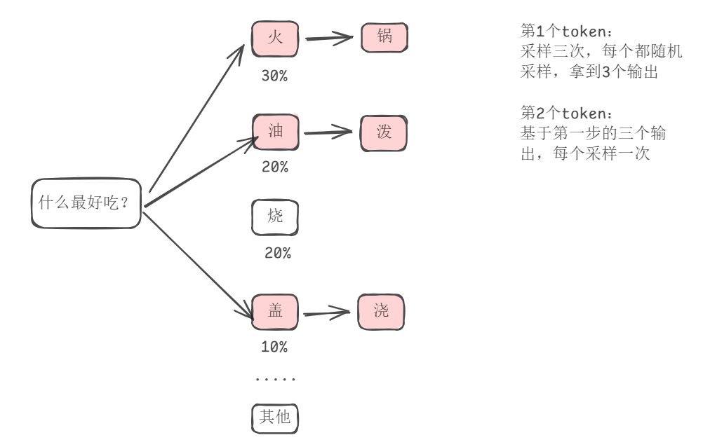

#### Parallel Sampling
一个输入N条输出，对于下一个token的输出，会有多个候选项，每个候选项有个对应的概率，采样N次拿到N个输出，相当于对同一条输入独立推理N次得到N条结果
N=3时如下所示，假如prefill阶段对“火”选中了两次，输出下一个token时继续采样就可以，maybe输出一个“火锅”一个”火鸡“


#### beam search
greedy search的缺点：每次选择当前最大概率的token作为输出，生成结果单一，没有考虑句子整体的组合
beam search：设置束宽（`Beam Width`），每一步保留topN个结果，按照**对数累计概率**筛选，将之前所有轮次的评分相乘作为结果，引入对数的原因是为了避免数值太小不好比较，top 3如下所示

```text
# 第一轮输出，选择概率最大的3个token
<START> → 
  - "I" (概率0.6)
  - "The" (概率0.3)
  - "A" (概率0.1)

# 第二轮输出，第一轮的输出token每个选择概率最大的3个token，分别计算累计概率，选择全局最大的三个结果
"I" → 
  - "I am" (0.6 × 0.5 = 0.30) # ✅ 第一大
  - "I have" (0.6 × 0.3 = 0.18) # ✅ 第二大
  - "I will" (0.6 × 0.2 = 0.12) # ✅ 第三大

"The" →
  - "The cat" (0.3 × 0.4)
  - "The dog" (0.3 × 0.3)
  - "The man" (0.3 × 0.3)

"A" →
  - "A beautiful" (0.1 × 0.4)
  - "A small" (0.1 × 0.3)
  - "A large" (0.1 × 0.3)

# 继续迭代……
```