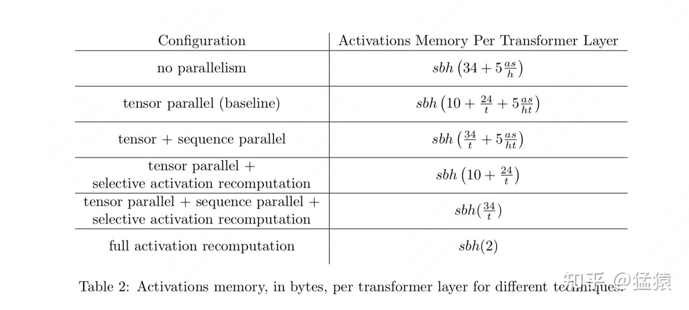
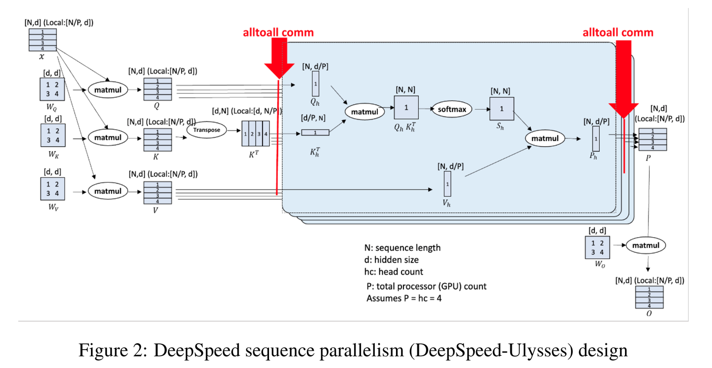
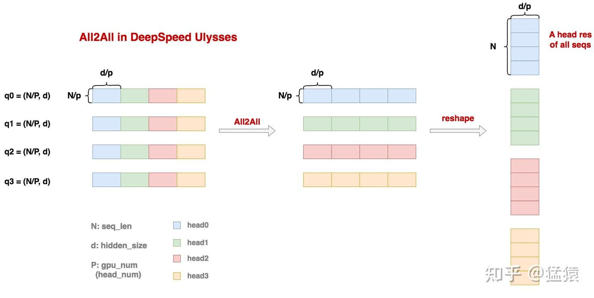

==补充一下代码实现==
megatron tp就是对连续的两个矩阵乘，第一个列切  第二个行切， 只需要进行一次all reduce的通信
tp只对attention内和mlp内的权重有效，
#### Megatron-LM tp （矩阵乘切分 降低权重占用）
对attention和mlp两个模块的权重进行切分，这两个模块都是有矩阵乘的部分，tp的前提的矩阵乘运算的可切分性；

以MLP为例，计算过程如下
$$Z=Dropout(GeLU(XA)B)$$
MLP的tp过程如下，权重矩阵A列切，权重矩阵B行切，最终得到的结果需要进行reduce(求和)

矩阵乘可切分性如下所示：
+ 只有一个矩阵乘 **权重列切 输入不需要切** 需要all-gather（图2右）
+ 只有一个矩阵乘 **权重行切 输入需要行切** 需要all-reduce（下图1和图2左）
+ 有两个矩阵乘 **第一个列切，第二个行切， 不切输入**，最后需要一个all-reduce（上图）


行切和列切对比如下：

attention的tp类似：attention中一般有个qkv_proj和o_proj，对这两个过程的权重进行切分， 输入不动，以qwen2为例，Qwen2Attention代码如下：
```python
class Qwen2Attention(nn.Module):
    def __init__():
        self.qkv_proj = QKVParallelLinear(xxx)
        self.o_proj = RowParallelLinear(xxx)
        self.attn = Attention(xxx)
        self.rotray_embed = RotaryEmbedding(xxx)
    def forward(self, positions: torch.Tensor, hidden_states: torch.Tensor)
        qkv, _ = self.qkv_proj(hidden_states)  # 列切
        q, k, v = qkv.split([self.q_size, self.kv_size, self.kv_size], dim=-1)
        q, k = self.rotary_emb(positions, q, k)
        attn_output = self.attn(q, k, v)
        output, _ = self.o_proj(attn_output)   # 行切
        return output
```

attention计算公式如下，顺手写一下，不过与tp无关
$$
\text{Attention}(Q, K, V) = \text{softmax}\left( \frac{QK^\top}{\sqrt{d_k}} \right) V
$$

Attention模块的tp方案如下所示，最后只需要一个all_reduce


#### Megatron-LM sp （序列切分 降低激活值占用）

回头看上述的tp方案，只是对attention和mlp模块的linear权重进行了切分，attention和MLP模块的输入输出都是完整的，去做layernorm dropout等操作，输入长度特别长的情况下，这部分的激活值现存占比巨大，具体的激活值占用情况可参考[猛猿-图解大模型训练系列：序列并行1，Megatron SP - 知乎](https://zhuanlan.zhihu.com/p/4083427292)和原论文[Reducing Activation Recomputation in Large Transformer Models](https://arxiv.org/pdf/2205.05198)

sp与tp搭配使用，整体如下，前向的过程中g表示all-gather，g̅表示reduce-scatter

Q: 为什么说megatron的sp必须与tp搭配使用，不能单独使用sp吗？
A: sp将输入切分为在多个gpu上去做layernorm，已经有多个gpu了难道还把linear的权重都复制一份到每个gpu上吗？太挫了，所以对linear的权重也会切分，即sp tp一起使用，至于Ulysses的sp不和tp搭配使用 到时候具体看下他的方案

该方案下的通信情况：保持了原有tp部分不变，对attention和MLP的输入/输出进行了sp处理，以MLP为例
+ MLP前的layernorm：输入进行了sp切分，输出也就是sp切分的，作为MLP的输入
+ MLP：MLP要求每张卡上都拿到完整的输入，进行一次**all-gather**，拿到完整的输入，然后正常进行tp运算
+ MLP后：按照tp的正常逻辑，MLP结束后需要进行一次*all-reduce*整合所有卡的输出结果(每张卡输出为 b,s,h)，但是当前引入sp的方案后，进行一次**reduce-scatter**（每张卡拿到的数据为 b, s/t, h），然后继续做dropout
通信情况对比：tp场景下：2次all-reduce；tp+sp场景下：2次all-gather + 2次reduce-scatter；两者通信量一致！但是单卡维护的激活值大幅降低

### DeepSpeed-Ulysses SP （alltoall低通信）

核心特点：
+ 低通信量
+ all-to-all
+ Ulysses + zero3
下图中：N = seq_len、 d = hidden_size、  P = gpu_num，通常head_num是P的整数倍

Ulysses不对模型权重进行切分，每张卡上保存有全量的模型权重（Zero3可能会改变），结合上图整体流程如下：
1. 输入切分：输入为$(N, d)$,沿seq维度进行切分，每张卡上输入为$(N/P, d)$
2. 计算QKV：每张卡上有完整的QKV映射矩阵权重，shape为$(d, d)$，输出结果为$(N/P, d)$
3. all-to-all通信：下一步要去做attention计算了，要求seq维度完整，通过all-to-all通信后每张卡上的输入为$(N, d/P)$,这个地方还有一个reshape，如下图所示
4. attention计算：正常执行，输出shape仍为$(N, d/P)$，后面接一个o_proj，权重shape为$(d, d)$，因此需要再进行一个all-to-all，将每张卡上的数据转化为$(N/P, d)$
5. o_proj计算：正常计算，相当于输入左矩阵行切，权重右矩阵不变，输出仍为$(N/P, d)$
6. MLP计算：mlp不需要计算token间的相关性，正常执行，和o_proj一样


此外Ulysses SP结合Zero3的方式？我觉得mengyuan说的不对，有待商榷！ 权重已经切分到多张卡了，实际计算的过程还是通过通信拿到全量的权重，这对吗铁铁？
##### 差异对比
+ 经过QKV映射矩阵后，Ulysses会通过all-to-all每张卡上拿到$(N, d/p)$，megatron会通过allgather拿到全量的 $(N, d)$
+ attention正常计算，对于后面的o矩阵Ulysses不切分权重矩阵，因此需要一个all-to-all将输入转化为$(N/P, d)$，对于后面的MLP也正常计算就可以；megatron通过tp先列切映射矩阵，再对o矩阵行切，输出结果需要进行all reduce，后面一直到mlp前面的dropout、norm操作对特征维度操作，因此也可以需要切分，因此直接reducescatter使得每张卡上的激活值大幅降低；
+ 通信量的比对：megatron sp+tp：2次allgather2次reducescatter <----> Ulysses sp: 4次all-to-all（QKV映射矩阵输出结果都需要一个alltoall+o矩阵的输入）按照mengyuan的分析，前者通信量为8Nd，后者为(8Nd)/P，可以看到随着卡数
### CP
涉及到flash attention 先搞这个

### EP
### 碎碎念
TP带宽要求高，一般都是在一个节点内
EP主要用alltoall，256专家，一共8卡，EP8，rank0: 0~31 rank1: 32~63

稠密层（attention）的$DP = worldsize/(TP*PP*CP)$，有多少份完整的权重，DP就是多少!
稀疏层（MoE）的$DP = worldsize/(TP*PP*CP*EP)$
