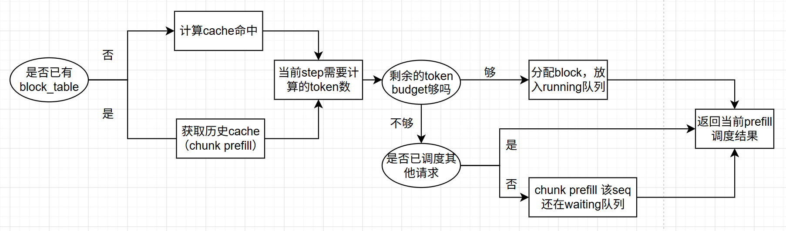
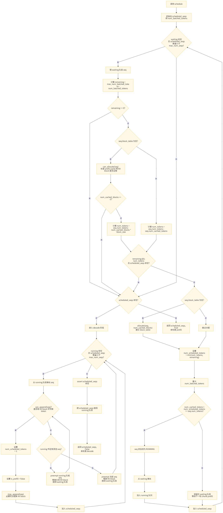

调度
优先调度prefill，
+ 对于每个新的请求，都需要经过1 `can_allocate`计算出是否能被调度，以及prefix cache命中情况 2 `allocate`来实际分配block并放到block_table中
+ nano为了实现简单，budget不够的情况，只对当前step调度的第一条请求做chunk prefill，其他的请求直接视为无法调度，**可以关注下vllm的实现逻辑**

