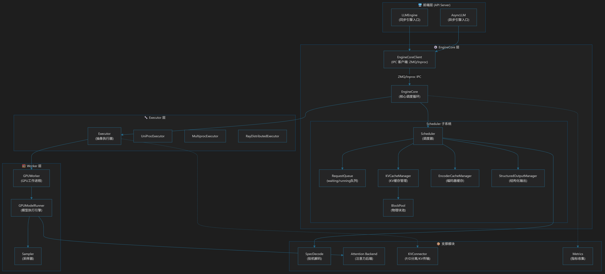
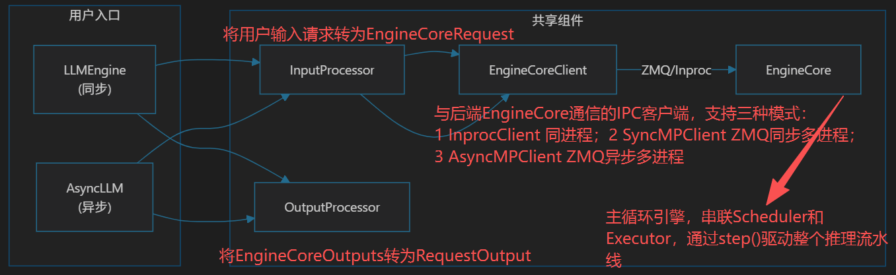
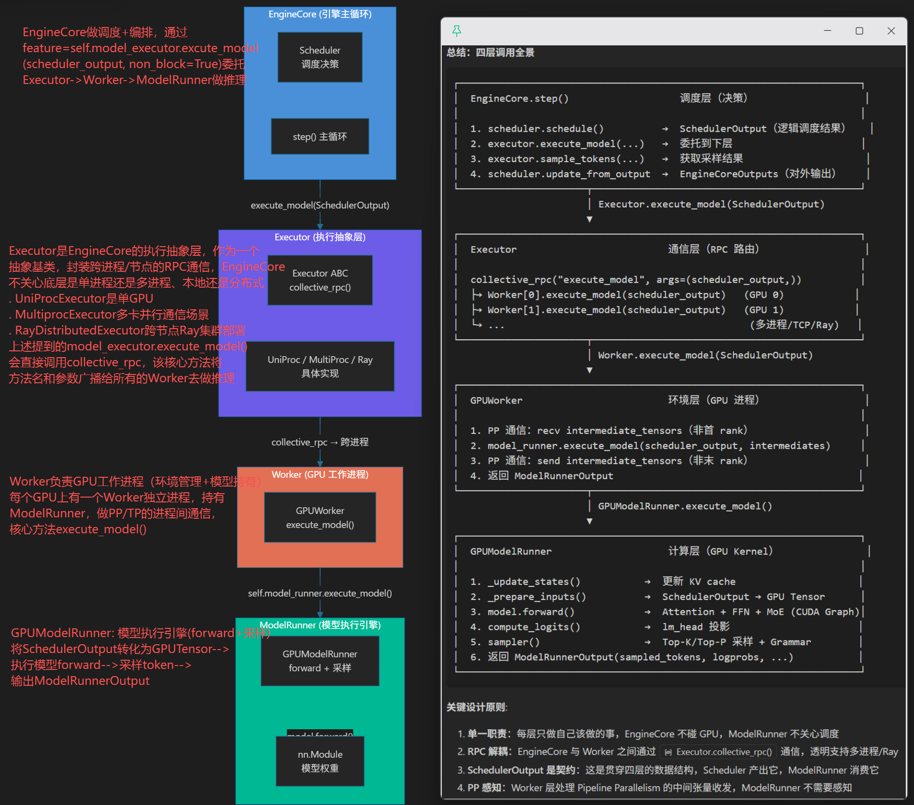

理解 vLLM v1 的整体架构和核心数据流。
- 在代码中添加日志，跟踪一个请求从接收到返回的完整路径
- 绘制 vLLM v1 的架构图
- 手动计算一个简单请求的 slot_mapping 值

第一部分：前端到后端，关于前端层LLMEngine和AsyncLLM是并行的，都是作为vLLM的API入口，并且实现了EngineClient协议(与后端Enginecore通信的IPC客户端)，都有相同的组件
+ LLMEngine：同步模式、v0、离线推理场景
+ AsyncLLM：异步模式、v1、在线服务高并发场景

第二部分：EngineCore---》Scheduler
Scheduler中KVCacheManager的使用路径
```
schedule()
  ├─ kv_cache_manager.new_step_starts()          # 步骤开始
  │
  ├─ [scheduling WAITING requests]
  │    ├─ kv_cache_manager.get_computed_blocks()  # 查前缀缓存
  │    └─ kv_cache_manager.allocate_slots()       # 分配 KV 块
  │         └─ 若返回 None → 内存不足 → 抢占低优先级请求
  │
  ├─ [scheduling RUNNING requests]
  │    └─ kv_cache_manager.allocate_slots()       # 为 decode 分配 token 的块
  │
update_from_output()
  ├─ [请求完成]
  │    └─ kv_cache_manager.free(request)         # 释放完成的请求的块
  │
  └─ kv_cache_manager.take_events()              # 收集 KV cache 事件（用于外部监控）
```
KVConnector在Scheduler中的使用
```
# schedule() 中：查询远程 KV 缓存
if self.connector is not None:
    ext_tokens, load_kv_async = self.connector.get_num_new_matched_tokens(...)
    # → 获取远端已计算的 token 数，跳过本地重计算

# update_from_output() 中：处理 KV 传输完成
self._update_from_kv_xfer_finished(kv_connector_output)

# finish_requests() 中：通知 connector 请求结束
self._connector_finished(request)
```
Scheduler完整调度流程，待拆解
```
EngineCore.step()
│
├─ 1. scheduler.schedule()
│     │
│     ├─ kv_cache_manager.new_step_starts()          # 新步骤
│     │
│     ├─ [遍历 running 列表]
│     │   └─ 对每个运行中请求:
│     │       ├─ 计算 num_new_tokens (decode: 1 token; prefill: 剩余 tokens)
│     │       ├─ _try_schedule_encoder_inputs()       # 调度多模态输入
│     │       └─ kv_cache_manager.allocate_slots()    # 分配 KV 块
│     │           └─ None → 内存不足 → _preempt_request() 抢占
│     │
│     ├─ [遍历 waiting/skipped_waiting 队列]
│     │   └─ 对每个等待请求:
│     │       ├─ 检查 blocked 状态（grammar/remote KV/streaming）
│     │       ├─ _try_promote_blocked_waiting_request()
│     │       ├─ kv_cache_manager.get_computed_blocks() # 查前缀缓存
│     │       ├─ connector.get_num_new_matched_tokens() # 查远程缓存
│     │       └─ kv_cache_manager.allocate_slots()      # 分配 KV 块
│     │
│     └─ 返回 SchedulerOutput {
│           scheduled_new_reqs, scheduled_running_reqs,
│           num_scheduled_tokens, req_to_new_blocks,
│           scheduled_encoder_inputs, scheduled_spec_decode_tokens
│         }
│
├─ 2. executor.execute_model(scheduler_output)
│     └─ ModelRunnerOutput
│
├─ 3. scheduler.get_grammar_bitmask(scheduler_output)
│     └─ structured_output_manager.grammar_bitmask()
│         → 传给 executor.sample_tokens()
│
├─ 4. scheduler.update_from_output(scheduler_output, model_output)
│     │
│     ├─ 遍历 num_scheduled_tokens:
│     │   ├─ 处理 spec decode accept/reject
│     │   ├─ _free_encoder_inputs()
│     │   ├─ _update_request_with_output()  # 更新 token, 检查 stop
│     │   ├─ structured_output_manager.should_advance() / accept_tokens()
│     │   └─ _handle_stopped_request() → _free_request() → kv_cache_manager.free()
│     │
│     ├─ 处理 failed KV load → finish_requests(error_ids)
│     ├─ kv_cache_manager.take_events()     # 收集 KV 事件
│     └─ 返回 EngineCoreOutputs
│
└─ 5. post_step()
      └─ 更新 draft_token_ids（投机解码）
```
第三部分：EngineCore---》Executor


**vllm中有多少个进程？** [https://github.com/vllm-project/vllm/blob/main/docs/design/arch_overview.md](https://github.com/vllm-project/vllm/blob/main/docs/design/arch_overview.md)
最常见的是如下三个进程，DP>1的话还会有个DP Coordinator的进程
```
┌──────────────────────────────────────────────────────────────────────┐
│  进程1: API Server 进程                                              │
│                                                                      │
│  ┌─────────────────────────────────────────────────────────────────┐ │
│  │  AsyncLLM                                                       │ │
│  │  ├── InputProcessor          # 输入处理（分词、多模态、chat模板） │ │
│  │  ├── OutputProcessor         # 输出处理（反分词、logprobs）       │ │
│  │  ├── Renderer                # Chat模板渲染                      │ │
│  │  ├── IncrementalDetokenizer  # 增量反分词                        │ │
│  │  └── EngineCoreClient        # ZMQ客户端，与Core进程通信         │ │
│  │       ├── input_socket (ROUTER)  ──ZMQ──→ EngineCore            │ │
│  │       └── output_socket (PULL)   ←─ZMQ── EngineCore             │ │
│  └─────────────────────────────────────────────────────────────────┘ │
└──────────────────────────────────────────────────────────────────────┘

┌──────────────────────────────────────────────────────────────────────┐
│  进程2: EngineCore 进程                                              │
│                                                                      │
│  ┌─────────────────────────────────────────────────────────────────┐ │
│  │  EngineCore (EngineCoreProc)                                    │ │
│  │  ├── Scheduler               # 调度器                           │ │
│  │  │   ├── KVCacheManager      # KV缓存管理                      │ │
│  │  │   ├── RequestQueue        # 请求队列 (waiting/running)       │ │
│  │  │   └── StructuredOutputManager                               │ │
│  │  ├── ModelExecutor           # 模型执行器                       │ │
│  │  │   └── MultiprocExecutor / UniProcExecutor                   │ │
│  │  └── input/output threads     # ZMQ通信线程                    │ │
│  └─────────────────────────────────────────────────────────────────┘ │
└──────────────────────────────────────────────────────────────────────┘

┌──────────────────────────────────────────────────────────────────────┐
│  进程3: Worker 进程 (仅 MultiprocExecutor 时存在)                    │
│                                                                      │
│  ┌─────────────────────────────────────────────────────────────────┐ │
│  │  WorkerProc                                                     │ │
│  │  ├── WorkerWrapperBase                                          │ │
│  │  │   └── GPUModelRunner      # 模型运行器                      │ │
│  │  │       ├── model           # 实际的模型权重                   │ │
│  │  │       ├── kv_cache        # GPU上的KV缓存                   │ │
│  │  │       └── sampler         # 采样器                          │ │
│  │  ├── rpc_broadcast_mq        # 接收SchedulerOutput的MQ         │ │
│  │  └── worker_response_mq      # 发送ModelRunnerOutput的MQ       │ │
│  └─────────────────────────────────────────────────────────────────┘ │
└──────────────────────────────────────────────────────────────────────┘
```

**API Server和Enginecore之间是通过zmq通信的，那Enginecore和Worker之间、Worker之间、以及DP Coordinator与其他进程是如何通信的呢**
EngineCore与Worker之间通过共享内存广播通信
```
┌──────────────────┐         ZMQ          ┌──────────────────┐
│  API Server      │ ──── request ────→   │  EngineCore      │
│  (AsyncLLM)      │                       │  (后台进程)       │
│                  │ ←── output ──────    │                  │
└──────────────────┘                       └────────┬─────────┘
                                                    │
                                           ┌────────┴─────────┐
                                           │  Worker 进程(es)  │
                                           │  (ModelRunner)    │
                                           └──────────────────┘

EngineCore 进程                          Worker 进程
┌──────────────────────┐                ┌──────────────────────┐
│ MultiprocExecutor    │                │ WorkerProc           │
│                      │                │                      │
│  rpc_broadcast_mq ──┼── SHM MQ ───→ │  rpc_broadcast_mq    │           SchedulerOutput 广播给所有 Worker（每个 Worker 都需要执行）
│  (1 writer,          │  (广播)        │  (N readers)         │
│   world_size slots)  │                │                      │
│                      │                │  worker_response_mq  │
│  response_mqs ←─────┼── SHM MQ ──── │  (1 writer,          │           ModelRunnerOutput 只需从 output_rank （TP rank=0, PP rank=-1）的 Worker 返回
│  (per-worker MQ)     │  (单播)        │   1 reader)          │
└──────────────────────┘                └──────────────────────┘

# EngineCore 侧创建广播 MQ  将 handle 传给 Worker 进程
self.rpc_broadcast_mq = MessageQueue(
    self.world_size,        # 总 worker 数
    self.local_world_size,  # 本节点 worker 数
    max_chunk_bytes=max_chunk_bytes,
    connect_ip=mq_connect_ip,
)
scheduler_output_handle = self.rpc_broadcast_mq.export_handle()

# Worker侧 从 handle 创建 MQ reader 来接受Enginecor中的Executor传过来的SchedulerOutput
def _init_message_queues(self, input_shm_handle, vllm_config):
    self.rpc_broadcast_mq = MessageQueue.create_from_handle(
        input_shm_handle, self.worker.rank
    )

EngineCore.step()
  → scheduler.schedule() → SchedulerOutput
  → MultiprocExecutor.execute_model(scheduler_output)
  → collective_rpc("execute_model", args=(scheduler_output,))  # execute_model调用该方法
  → rpc_broadcast_mq.enqueue((method, args, kwargs, output_rank))
      ↓ SHM 广播
  → 所有 Worker 的 rpc_broadcast_mq.dequeue()
  → WorkerProc.worker_busy_loop() 接收并执行
```
Enginecore与DP Coordinator之间也通过zmq通信； worker之间通过NCCL (集合通信) (tp rank之间的all reduce等)

**ModelRunner v2 与v1的差异点**

### 性能摸高方法论

max_num_seqs是每个dp域内的，如果测并发40，dp2tp8，max_num_seqs就设为20，cudagraph_mode设置为FULL_DECODE_ONLY、MTP=5的时候，cudagraph_capture_sizes应该最大设置为20*6，都是6的倍数，从6开始

### 队列与调度

对于输入的请求先放到waiting队列，通过allocate_slots分配kvblock成功后，将请求放入running队列，然后去跑modelrunner

req_to_blocks记录请求对应的KVcacheblock，每个KVcacheblock有唯一的block_id，如果是满的block，才会有对应的_block_hash？？

现象：发送一条短请求，分配一个blcok，没满，不会有_block_hash，block_id为1；再发送一个新的长请求，分配了3个block，只有最后一个没有_block_hash，且block_id依次为2,3,4

### prefix cache

[https://github.com/vllm-project/vllm/pull/30877](https://github.com/vllm-project/vllm/pull/30877)

问题：一个请求只需要allocate_slots一次？

