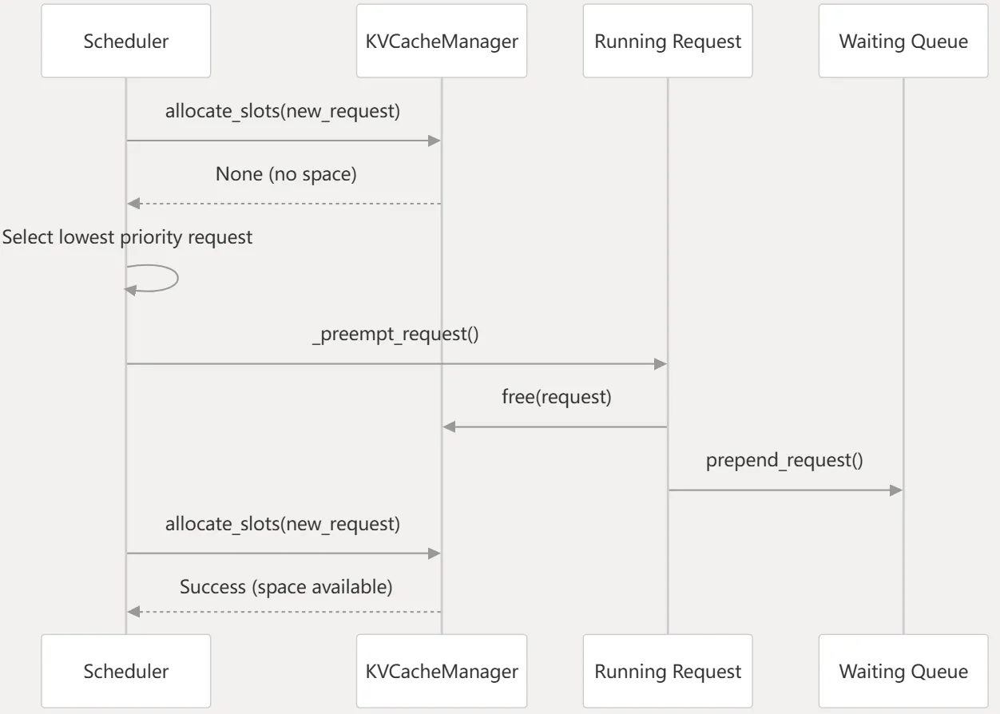

- 模拟不同场景下的调度行为（资源充足/不足/抢占）
- 调度器核心逻辑（chunk_prefill、抢占、重计算）
- KVCache管理（prefixCache）队列管理
- slot_mapping中Enginecore侧（kvmanager）需要做的事情


### 请求的抢占与重计算

1 为什么会触发Preemption?
显存不够，新的请求无法调度

2 为什么不等当前请求算完，再去调度新的请求，直接抢占该请求去调度新请求不就相当于拆东墙补西墙？
请求是有优先级的，FIFO，某个请求无法被调度时，优先丢掉最后加入running队列的请求，抢占的行为默认是recompute，swap（将GPU显存的kv放到CPU中，后面再拿回来，不需要重新计算）可以通过开关设置，beam search的场景需要swap
对于之前请求的KVCache，资源不够的情况下，采用LRU淘汰机制（最后产生的kv会被优先淘汰），对于refcnt不为0的不能淘汰

### vllm中不同场景的KVCache

常规attention
多模态的encode Cache
mamba(linear attn)的Cache
window attn的cache

### kvcache
##### 不同attn对应的KVCache管理策略
==window attention==

每次计算只需要固定长度窗口内的kv，有两种方式：1 全部保存下来，计算的时候只取需要的部分kv； 2 新的token会覆盖老的token，只保留win_size个token的kv
vllm按照kvblock的粒度来管理，因此实现上像是以上两种方式的结合：
+ 逻辑上按sliding window 只读窗口内 token
+ 物理上按 KV block 粒度释放窗口外 block
丢掉了kv不会影响prefix cache吗？ 和这个没关系！只是保存的更少了，prefixcache能不能命中 无所谓 和正常一样
##### 如何计算kvcache需要占用多少显存？

整体公式

其中：


```python
#D:\projects\vllm_projects\vllm\vllm\v1\worker\gpu_worker.py
class Worker(WorkerBase):
    def determine_available_memory(self) -> int:
        # 1. 根据--gpu-memory-utilization计算可用的总显存
        self.requested_memory = math.ceil(init_snapshot.total_memory * cache_config.gpu_memory_utilization)
        # 2. 通过prefile_run计算运行时所需显存
        with memory_profiling(self.init_snapshot, weights_memory=int(self.model_runner.model_memory_usage)) as profile_result:
            self.model_runner.profile_run()
            if not self.model_config.enforce_eager and not current_platform.is_rocm():
                cudagraph_memory_estimate = self.model_runner.profile_cudagraph_memory()  #cuda图占用
        profile_result.torch_peak_increase = (
            profile_torch_peak   # profile 过程中 PyTorch 分配器的峰值（根据MemorySnapshot记录显存状态）
            - profile_result.before_profile.torch_peak  # profile 前的峰值（主要是权重）
        )
        # 3. Non-KV-Cache 总显存
        profile_result.non_kv_cache_memory = (
            profile_result.non_torch_increase    # 非 PyTorch 管理的显存增量(NCCL buffer, CUDA context, cuBLAS workspace等)
            + profile_result.torch_peak_increase # PyTorch 管理的激活值峰值
            + profile_result.weights_memory      # 模型权重
        )
        # 4=1-2-3 最终计算！Total × utilization (如72GiB)-（权重+激活峰值+非torch）-cuda graph占用
        self.available_kv_cache_memory_bytes = (
            self.requested_memory
            - profile_result.non_kv_cache_memory
            - cudagraph_memory_estimate_applied
        )
        
```

##### kvcache初始化流程

这个是engine/core.py中EngineCore中的kvcache初始化，gpu_model_runner.py中GPUModelRunner中同样也有initialize_kv_cache，两者的差异？
EngineCore中的初始化主要根据模型结构和可用显存空间，生成kv_cache_config，

```python
def _initialize_kv_caches(self, vllm_config: VllmConfig) -> KVCacheConfig:

    # Get all kv cache needed by the model
    kv_cache_specs = self.model_executor.get_kv_cache_specs()
# step1: 记录各个worker的各个layer上，attn模块相关的kv cache元数据,即kvcache的需求规格。还没有进行实际的kvcache的分配
#结果描述：kv_cache_specs中有两个字典，分别对应每个worker，tp2的场景中两个字典中的spec是完全一样的，都是每一层attention对应的spec 例如：
# 'language_model.model.layers.3.self_attn.attn': FullAttentionSpec(block_size=1024, num_kv_heads=1, head_size=256, dtype=torch.bfloat16, page_size_padded=1067008, head_size_v=256, sliding_window=None, attention_chunk_size=None)
# 'language_model.model.layers.22.linear_attn': MambaSpec(block_size=9000, shapes=((3, 3072), (8, 128, 128)), dtypes=(torch.bfloat16, torch.float32), page_size_padded=1067008, mamba_type='gdn_attention', mamba_cache_mode='none', num_speculative_blocks=0)
INFO 03-26 10:03:15 [worker.py:357] Available KV cache memory: 46.51 GiB
available_gpu_memory:[49939304448, 49947838054]

-kv_cache_configs: [KVCacheConfig(num_blocks=7800, kv_cache_tensors=[KVCacheTensor(size=8322662400, shared_by=['language_model.model.layers.3.self_attn.attn', 'language_model.model.layers.0.linear_attn', 'language_model.model.layers.1.linear_attn', 'language_model.model.layers.2.linear_attn']), KVCacheTensor(size=8322662400, shared_by=['language_model.model.layers.7.self_attn.attn', 'language_model.model.layers.4.linear_attn', 'language_model.model.layers.5.linear_attn', 'language_model.model.layers.6.linear_attn']), KVCacheTensor(size=8322662400, shared_by=['language_model.model.layers.11.self_attn.attn', 'language_model.model.layers.8.linear_attn', 'language_model.model.layers.9.linear_attn', 'language_model.model.layers.10.linear_attn']), KVCacheTensor(size=8322662400, shared_by=['language_model.model.layers.15.self_attn.attn', 'language_model.model.layers.12.linear_attn', 'language_model.model.layers.13.linear_attn', 'language_model.model.layers.14.linear_attn']), KVCacheTensor(size=8322662400, shared_by=['language_model.model.layers.19.self_attn.attn', 'language_model.model.layers.16.linear_attn', 'language_model.model.layers.17.linear_attn', 'language_model.model.layers.18.linear_attn']), KVCacheTensor(size=8322662400, shared_by=['language_model.model.layers.23.self_attn.attn', 'language_model.model.layers.20.linear_attn', 'language_model.model.layers.21.linear_attn', 'language_model.model.layers.22.linear_attn'])], 

kv_cache_groups=[KVCacheGroupSpec(layer_names=['language_model.model.layers.3.self_attn.attn', 'language_model.model.layers.7.self_attn.attn', 'language_model.model.layers.11.self_attn.attn', 'language_model.model.layers.15.self_attn.attn', 'language_model.model.layers.19.self_attn.attn', 'language_model.model.layers.23.self_attn.attn'], kv_cache_spec=FullAttentionSpec(block_size=1024, num_kv_heads=1, head_size=256, dtype=torch.bfloat16, page_size_padded=1067008, head_size_v=256, sliding_window=None, attention_chunk_size=None)), KVCacheGroupSpec(layer_names=['language_model.model.layers.0.linear_attn', 'language_model.model.layers.4.linear_attn', 'language_model.model.layers.8.linear_attn', 'language_model.model.layers.12.linear_attn', 'language_model.model.layers.16.linear_attn', 'language_model.model.layers.20.linear_attn'], kv_cache_spec=MambaSpec(block_size=9000, shapes=((3, 3072), (8, 128, 128)), dtypes=(torch.bfloat16, torch.float32), page_size_padded=1067008, mamba_type='gdn_attention', mamba_cache_mode='none', num_speculative_blocks=0)), KVCacheGroupSpec(layer_names=['language_model.model.layers.1.linear_attn', 'language_model.model.layers.5.linear_attn', 'language_model.model.layers.9.linear_attn', 'language_model.model.layers.13.linear_attn', 'language_model.model.layers.17.linear_attn', 'language_model.model.layers.21.linear_attn'], kv_cache_spec=MambaSpec(block_size=9000, shapes=((3, 3072), (8, 128, 128)), dtypes=(torch.bfloat16, torch.float32), page_size_padded=1067008, mamba_type='gdn_attention', mamba_cache_mode='none', num_speculative_blocks=0)), KVCacheGroupSpec(layer_names=['language_model.model.layers.2.linear_attn', 'language_model.model.layers.6.linear_attn', 'language_model.model.layers.10.linear_attn', 'language_model.model.layers.14.linear_attn', 'language_model.model.layers.18.linear_attn', 'language_model.model.layers.22.linear_attn'], kv_cache_spec=MambaSpec(block_size=9000, shapes=((3, 3072), (8, 128, 128)), dtypes=(torch.bfloat16, torch.float32), page_size_padded=1067008, mamba_type='gdn_attention', mamba_cache_mode='none', num_speculative_blocks=0))]),

 KVCacheConfig(num_blocks=7800, kv_cache_tensors=[KVCacheTensor(size=8322662400, shared_by=['language_model.model.layers.3.self_attn.attn', 'language_model.model.layers.0.linear_attn', 'language_model.model.layers.1.linear_attn', 'language_model.model.layers.2.linear_attn']), KVCacheTensor(size=8322662400, shared_by=['language_model.model.layers.7.self_attn.attn', 'language_model.model.layers.4.linear_attn', 'language_model.model.layers.5.linear_attn', 'language_model.model.layers.6.linear_attn']), KVCacheTensor(size=8322662400, shared_by=['language_model.model.layers.11.self_attn.attn', 'language_model.model.layers.8.linear_attn', 'language_model.model.layers.9.linear_attn', 'language_model.model.layers.10.linear_attn']), KVCacheTensor(size=8322662400, shared_by=['language_model.model.layers.15.self_attn.attn', 'language_model.model.layers.12.linear_attn', 'language_model.model.layers.13.linear_attn', 'language_model.model.layers.14.linear_attn']), KVCacheTensor(size=8322662400, shared_by=['language_model.model.layers.19.self_attn.attn', 'language_model.model.layers.16.linear_attn', 'language_model.model.layers.17.linear_attn', 'language_model.model.layers.18.linear_attn']), KVCacheTensor(size=8322662400, shared_by=['language_model.model.layers.23.self_attn.attn', 'language_model.model.layers.20.linear_attn', 'language_model.model.layers.21.linear_attn', 'language_model.model.layers.22.linear_attn'])], 
 
 kv_cache_groups=[KVCacheGroupSpec(layer_names=['language_model.model.layers.3.self_attn.attn', 'language_model.model.layers.7.self_attn.attn', 'language_model.model.layers.11.self_attn.attn', 'language_model.model.layers.15.self_attn.attn', 'language_model.model.layers.19.self_attn.attn', 'language_model.model.layers.23.self_attn.attn'], kv_cache_spec=FullAttentionSpec(block_size=1024, num_kv_heads=1, head_size=256, dtype=torch.bfloat16, page_size_padded=1067008, head_size_v=256, sliding_window=None, attention_chunk_size=None)), KVCacheGroupSpec(layer_names=['language_model.model.layers.0.linear_attn', 'language_model.model.layers.4.linear_attn', 'language_model.model.layers.8.linear_attn', 'language_model.model.layers.12.linear_attn', 'language_model.model.layers.16.linear_attn', 'language_model.model.layers.20.linear_attn'], kv_cache_spec=MambaSpec(block_size=9000, shapes=((3, 3072), (8, 128, 128)), dtypes=(torch.bfloat16, torch.float32), page_size_padded=1067008, mamba_type='gdn_attention', mamba_cache_mode='none', num_speculative_blocks=0)), KVCacheGroupSpec(layer_names=['language_model.model.layers.1.linear_attn', 'language_model.model.layers.5.linear_attn', 'language_model.model.layers.9.linear_attn', 'language_model.model.layers.13.linear_attn', 'language_model.model.layers.17.linear_attn', 'language_model.model.layers.21.linear_attn'], kv_cache_spec=MambaSpec(block_size=9000, shapes=((3, 3072), (8, 128, 128)), dtypes=(torch.bfloat16, torch.float32), page_size_padded=1067008, mamba_type='gdn_attention', mamba_cache_mode='none', num_speculative_blocks=0)), KVCacheGroupSpec(layer_names=['language_model.model.layers.2.linear_attn', 'language_model.model.layers.6.linear_attn', 'language_model.model.layers.10.linear_attn', 'language_model.model.layers.14.linear_attn', 'language_model.model.layers.18.linear_attn', 'language_model.model.layers.22.linear_attn'], kv_cache_spec=MambaSpec(block_size=9000, shapes=((3, 3072), (8, 128, 128)), dtypes=(torch.bfloat16, torch.float32), page_size_padded=1067008, mamba_type='gdn_attention', mamba_cache_mode='none', num_speculative_blocks=0))])]
```

举例如下：Qwen2.5-0.5B-Instruct模型共有24层，"num_key_value_heads": 2,"num_attention_heads": 14,"hidden_size":896,即head_dim=896/14=64

```python
# 服务化拉起时部分打印结果如下：
vllm_config.cache_config:CacheConfig(block_size=128,...)
kv_cache_specs:[{'model.layers.0.self_attn.attn': FullAttentionSpec(block_size=128, num_kv_heads=2, head_size=64, dtype=torch.bfloat16, page_size_padded=None, head_size_v=64, sliding_window=None, attention_chunk_size=None),...]

(EngineCore pid=22454) INFO 04-12 07:25:25 [worker.py:357] Available KV cache memory: 54.07 GiB
(EngineCore pid=22454) INFO 04-12 07:25:25 [kv_cache_utils.py:1316] GPU KV cache size: 4,724,608 tokens
(EngineCore pid=22454) INFO 04-12 07:25:25 [kv_cache_utils.py:1321] Maximum concurrency for 32,768 tokens per request: 144.18x

kv_cache_configs: KVCacheConfig(num_blocks=36911, kv_cache_tensors=[KVCacheTensor(size=2418999296, shared_by=['model.layers.0.self_attn.attn']),...],  kv_cache_groups=[KVCacheGroupSpec(layer_names=['model.layers.0.self_attn.attn',...],kv_cache_spec=FullAttentionSpec(block_size=128, num_kv_heads=2, head_size=64, dtype=torch.bfloat16, page_size_padded=None, head_size_v=64, sliding_window=None, attention_chunk_size=None))])

# 详细结果如下：
KVcache总容量为54.07 GiB--单层容量为54.07/24=2.25 GiB = 2418999296 bytes
                ⬇️
单层的block数量为2418999296/65536=36911，单层的token数量为36911*128=4724608，每个token在每一层有不同的kv，即全局的token容量为4724608
                ⬆️                                                         
单层单个token的K V元素个数都是num_kv_heads * head_dim =2*64-=128, KV一起是128*2=256，bf16场景下单层单个token大小为256*2=512 bytes，单层单block大小为512*block_size=512*128=65536 bytes                                                               
```

ModelRunner的initialize_kv_cache

##### 每个调度step为请求分配kvcache block

理解每个参数的含义，再回头看代码注释中的示意图！

```python

def allocate_slots(
        self,
        request: Request,
        num_new_tokens: int,
        num_new_computed_tokens: int = 0,
        new_computed_blocks: KVCacheBlocks | None = None,
        num_lookahead_tokens: int = 0,
        num_external_computed_tokens: int = 0,
        delay_cache_blocks: bool = False,
        num_encoder_tokens: int = 0,
    ) -> KVCacheBlocks | None:
    """
    【Inputs】
        request：请求
        num_new_tokens：本轮需要计算的token数
        num_new_computed_tokens：prefix cache命中的token数
        new_computed_blocks：prefix cache命中token对应的block，与num_new_computed_tokens搭配使用
        num_lookahead_tokens：投机解码预留的token数
        num_external_computed_tokens：PD分离场景，D从P拉过来的KV，需要申请block存放
        xx
    
    【场景举例】请求长度100个token，block_size为16
        普通prefill：num_new_tokens=100，分配 ceil(100/16) = 7 个 block
        prefix cache命中前64个+prefill：num_new_tokens=36, num_new_computed_tokens=64,new_computed_blocks=cached_4_blocks,复用 4 个 block + 新分配 ceil(36/16) = 3 个 block
        普通decode：num_new_tokens=1,
        mtp3+decode：num_new_tokens=1,num_lookahead_tokens=3
    【Blocks layout】
        ```
        ----------------------------------------------------------------------
        | < comp > | < new_comp > | < ext_comp >  | < new >  | < lookahead > |
        ----------------------------------------------------------------------
                                                  |   < to be computed >     |
        ----------------------------------------------------------------------
                                  |            < to be allocated >           |
        ----------------------------------------------------------------------
                                  | < to be cached (roughly, |
                                  | details below)>          |
        ----------------------------------------------------------------------
        | Prefix-cached tokens from either vLLM   |
        | or connector. Can be safely removed if  |
        | they are outside sliding window.        |
        ----------------------------------------------------------------------
        |   < cached by vLLM >    | not cached by |
                                  | vLLM, but     |
        | ref_cnt  | ref_cnt not  | cached by     |
        | increased| increased yet| connector     |
        ----------------------------------------------------------------------
        ```

        Abbrivations:

        ```
        comp      = request.num_computed_tokens  已经ready的，kv在本地，已挂到请求上，不需要任何操作（可能是上一个step从P节点拉过来的 或者prefixcache命中的或者上一个step计算的）
        new_comp  = num_new_computed_tokens  prefixcache命中的，kv在本地，需要ref_count++，每次allocate_slots之前会调用get_computed_blocks查找命中的缓存，block粒度
                  = len(new_computed_blocks) * block_size
        ext_comp  = num_external_computed_tokens, cached by the connector PD分离场景存在P节点的cache，正在传输到当前节点，需要分配空block接受
        new       = num_new_tokens, including unverified draft tokens 本轮需要计算的，需要分配block
        lookahead = num_lookahead_tokens 投机解码预留block
        ```
    【Returns】
        分配的KVCacheBlocks

    【执行逻辑】
        allocate_slots() 
        │
        ├── ① 计算各种 token 数
        ├── ② remove_skipped_blocks()     ← 释放滑动窗口外的旧 block，对于sliding window attention，将窗口外的cache直接释放掉
        ├── ③ get_num_blocks_to_allocate() ← 算需要多少新 block
        ├── ④ 检查 free block 够不够       ← 不够返回 None，scheduler收到None后，对于waiting队列，会继续等待，对于running队列，会触发preemption，抢占低优先或后进来请求的kvcache
        ├── ⑤ allocate_new_computed_blocks() ← prefix cache 命中的 block 挂到请求上，ref_count +1
        ├── ⑥ allocate_new_blocks()        ← 从 free pool 取新 block,每个block里面都是0，等到实际forward的时候再填入具体的kv
        ├── ⑦ cache_blocks()              ← 把填满的 block 注册到 hash table
        └── ⑧ return new_blocks
    """
    return self.create_kv_cache_blocks(new_blocks)
    
```

不同场景的输入参数变化

场景1：最简单的场景，输入prompt长度55
第一个step做prefill，num_new_tokens=55,后面decode阶段每次num_new_tokens=1，num_computed_tokens +1

|   |   |   |   |   |   |
|---|---|---|---|---|---|
|step|request.num_computed_tokens|num_new_computed_tokens|num_external_computed_tokens|num_new_tokens|num_lookahead_tokens|
|1|0|0|0|55|0|
|2|55|0|0|1|0|
|3|56|0|0|1|0|

场景2：mtp3 `--speculative_config '{"method": "qwen3_5_mtp", "num_speculative_tokens": 3, "enforce_eager": true}'`
在场景1的基础上每次需要为投机解码预留3个token的位置，要是草稿模型的三个输出全部被接受，那下一个step request.num_computed_tokens+4，要是全部不接受，request.num_computed_tokens +1 只有主模型的token了

|   |   |   |   |   |   |
|---|---|---|---|---|---|
|step|request.num_computed_tokens|num_new_computed_tokens|num_external_computed_tokens|num_new_tokens|num_lookahead_tokens|
|1|0|0|0|55|0|
|2|55|0|0|4|3|
|3|59|0|0|4|3|

场景3：chunk prefill 输入长度2103 `--enable-prefix-caching --max-num-batched-tokens 1025`

|   |   |   |   |   |   |
|---|---|---|---|---|---|
|step|request.num_computed_tokens|num_new_computed_tokens|num_external_computed_tokens|num_new_tokens|num_lookahead_tokens|
|1|0|0|0|1024|0|
|2|1024|0|0|1025|3|
|3|2049|0|0|54|3|
|4|2103|0|0|4|3|
|5|2107|0|0|4|3|

场景4：prefix cache命中 输入prompt长度1318，重复发了两次，第二次的时候会命中1024个 num_new_computed_tokens=24，剩下294还是需要重新算，**命中的粒度是1024如何定下来的？？？**
第一条请求

|      |                             |                         |                              |                |                      |
| ---- | --------------------------- | ----------------------- | ---------------------------- | -------------- | -------------------- |
| step | request.num_computed_tokens | num_new_computed_tokens | num_external_computed_tokens | num_new_tokens | num_lookahead_tokens |
| 1    | 0                           | 0                       | 0                            | 1024           | 0                    |
| 2    | 1024                        | 0                       | 0                            | 294            | 0                    |
| 3    | 1318                        | 0                       | 0                            | 1              | 0                    |
| 4    | 1319                        | 0                       | 0                            | 1              | 0                    |
| 5    | 1320                        | 0                       | 0                            | 1              | 0                    |
| 6    | 1321                        | 0                       | 0                            | 1              | 0                    |
第二条请求

|   |   |   |   |   |   |
|---|---|---|---|---|---|
|step|request.num_computed_tokens|num_new_computed_tokens|num_external_computed_tokens|num_new_tokens|num_lookahead_tokens|
|1|0|1024|0|294|0|
|2|1318|0|0|1|0|
|3|1319|0|0|1|0|
|4|1320|0|0|1|0|
|5|1321|0|0|1|0|
场景5：PD分离
##### ModelRunner实际推理forward时如何通过slot_mapping将kvcache写入block？

##### mamba kvcache以及hybrid方案

当前SGLang有双池方案，且mamba block支持bf16，vLLM当前只有一种kvblock，要full attention和linear attention都要用，同时写入kv、conv_state、ssm_state，非连续----》连续，非连续对于conv_state和ssm_state没到block size时进行pad，会造成显存浪费，连续的方案就不会浪费了，需要fia等算子支持

==这个整明白了可以梳理一下其他几类attn对应的spec与kv逻辑==
减层为8层，3层linear+full 两次
kvgroups如何分组的：共有4个group，因此`kv_cache_groups`中有4个`KVCacheGroupSpec`，每个group对应一种attn的spec，groups数量根据重复pattern来的，当前是`linear0, linear1, linear2, full_attn`循环两次，即4个group，要是模型中只有一种attn的话，就只有一个group
物理KVCacheTensor怎么切：`kv_cache_groups` 是逻辑分组；`kv_cache_tensors` 是 worker 真正分配显存的物理 tensor。将物理空间切分成group_size份，即2份
```python
 KVCacheConfig(num_blocks=13227, 
 kv_cache_tensors=[KVCacheTensor(size=28226629632, shared_by=['language_model.model.layers.3.self_attn.attn', 'language_model.model.layers.0.linear_attn', 'language_model.model.layers.1.linear_attn', 'language_model.model.layers.2.linear_attn']), 
					KVCacheTensor(size=28226629632, shared_by=['language_model.model.layers.7.self_attn.attn', 'language_model.model.layers.4.linear_attn', 'language_model.model.layers.5.linear_attn', 'language_model.model.layers.6.linear_attn'])], 
kv_cache_groups=[KVCacheGroupSpec(layer_names=['language_model.model.layers.3.self_attn.attn', 'language_model.model.layers.7.self_attn.attn'], kv_cache_spec=FullAttentionSpec(block_size=1024, num_kv_heads=2, head_size=256, dtype=torch.bfloat16, kv_quant_mode=<KVQuantMode.NONE: 0>, page_size_padded=2134016, head_size_v=256, sliding_window=None, attention_chunk_size=None), is_eagle_group=False), 
				KVCacheGroupSpec(layer_names=['language_model.model.layers.0.linear_attn', 'language_model.model.layers.4.linear_attn'], kv_cache_spec=MambaSpec(block_size=133000, shapes=((3, 6144), (16, 128, 128)), dtypes=(torch.bfloat16, torch.float32), page_size_padded=2134016, mamba_type=<MambaAttentionBackendEnum.GDN_ATTN: 'vllm.v1.attention.backends.gdn_attn.GDNAttentionBackend'>, mamba_cache_mode='none', num_speculative_blocks=0), is_eagle_group=False), 
				KVCacheGroupSpec(layer_names=['language_model.model.layers.1.linear_attn', 'language_model.model.layers.5.linear_attn'], kv_cache_spec=MambaSpec(block_size=133000, shapes=((3, 6144), (16, 128, 128)), dtypes=(torch.bfloat16, torch.float32), page_size_padded=2134016, mamba_type=<MambaAttentionBackendEnum.GDN_ATTN: 'vllm.v1.attention.backends.gdn_attn.GDNAttentionBackend'>, mamba_cache_mode='none', num_speculative_blocks=0), is_eagle_group=False), 
				KVCacheGroupSpec(layer_names=['language_model.model.layers.2.linear_attn', 'language_model.model.layers.6.linear_attn'], kv_cache_spec=MambaSpec(block_size=133000, shapes=((3, 6144), (16, 128, 128)), dtypes=(torch.bfloat16, torch.float32), page_size_padded=2134016, mamba_type=<MambaAttentionBackendEnum.GDN_ATTN: 'vllm.v1.attention.backends.gdn_attn.GDNAttentionBackend'>, mamba_cache_mode='none', num_speculative_blocks=0), is_eagle_group=False)])
```


**不同并行策略下kvcache的影响，如cp会切分kv**

### vllm 显存占用分析

Total Requested=total_memory×gpu_memory_utilization

KV Cache Memory=Total Requested−Weights−Peak Activations−CUDA Graph Memory  
  

--max-num-batched-tokens →控制激活值显存

profile_run 中的dummy_run会根据max-num-batched-tokens构建dummy_batch，跑一次前向，测出峰值激活显存

--max-model-len 计算出需要的KVcache大小

如果设置 --max-model-len -1，vLLM 会根据可用 KV Cache 显存自动计算能支持的最大 context length

遗留问题： profile_run 是在干什么？ 根据max-model-len如何计算所需的KVcache大小？长上下文900K场景，需要吧max-model-len设置很大 >=900K ， max-num-batched-tokens可以设置10000左右即可，max-model-len会被chunk prefill切分，具体怎么切分的？