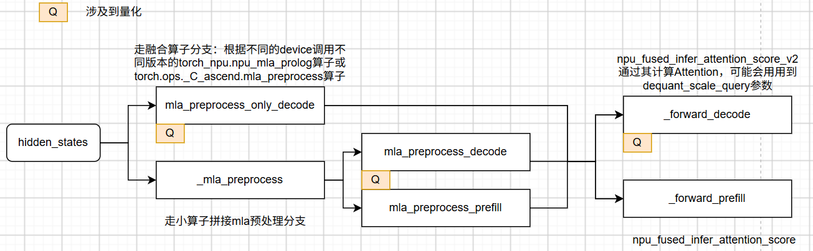
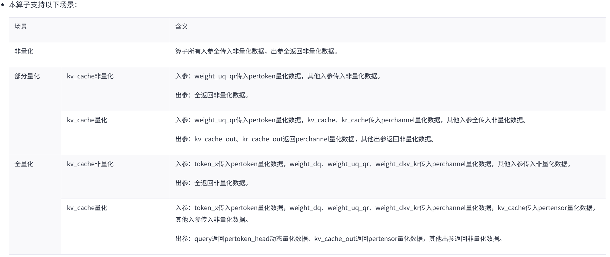

attention相关量化分为三类：fa_quant_type、indexer_quant_type、kv_cache_type
#### 普通GQA的C8 Attention 
相关PR：https://github.com/vllm-project/vllm-ascend/issues/7474
+ 写 cache 前，K/V 用静态 per-channel scale/offset 量化成 int8
+ decode 直接用 int8 paged KV，FIA 内部 antiquant，核心算子是 `torch_npu.npu_fused_infer_attention_score`，需传入 `key_antiquant_scale/value_antiquant_scale`
+ prefill 部分先 dequant，然后将浮点的kv传入`torch_npu.npu_fused_infer_attention_score`
Q1：modelslim导出的是什么？
Q2：为什么FIA的prefill和decode实现逻辑不一样？

#### MLA：FAKQuant / FA quant
mla计算逻辑见：[各种attention#MLA](../../../1.%20models/各种attention.md#MLA)
vllm-ascend实现逻辑如下，只对decode部分做了量化加速

##### 量化部分1：mla_preprocess_only_decode
主要是mlapo融合算子内部的一些量化，涉及到KVCache的写入

##### 量化部分2：mla_preprocess_decode

